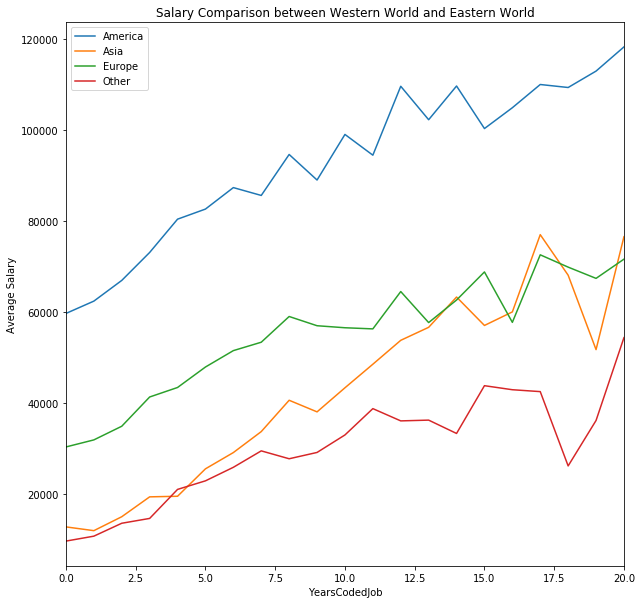
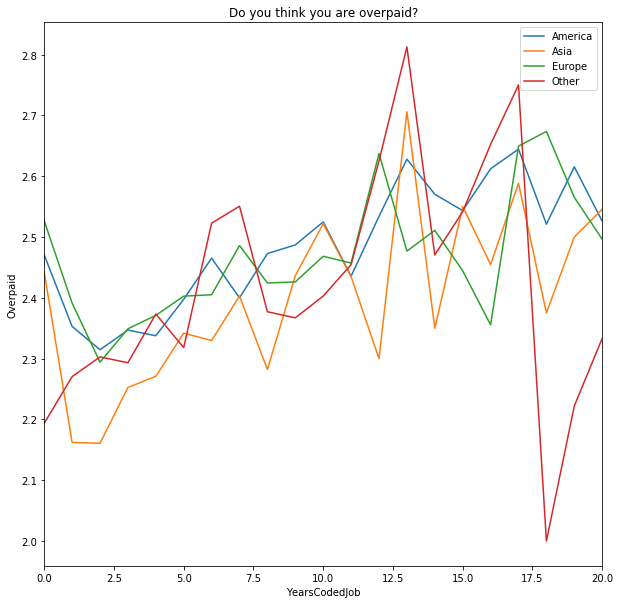
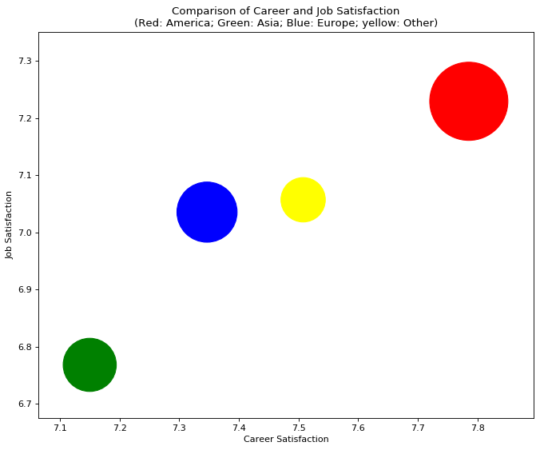

### Introduction
There are not many different views when it comes to the IT career that are biased toward working in USA rather than Asia or Europe specifically if you are a Software Engineer. In this blog I want to conclude if this is a legitimate bias or not based on the information that is provided by people on Stack Overflow.

Basically I try to find out which continent is considered beat for a developer to work in!

# Question 1: Is iti better for me to relocate or Not?

At the end of this blog we can understand that, regarding the salary a programmer get, America is the highly paid. In the next rank are Europe and Asia.
But as every one may know Job satisfaction is not directly related to only Salary, there are much more criteria that should be investigated.

The data here are actual salary overall developers in the survey, but as we discussed it could be more interesting to know how the difference of job satisfaction, career satisfaction and salary between America, Europe, Asia and Other Places.

# Question 2: How do you think of your salary?
In the chart below, I was interested in how the developers think about their salary, is it underpaid or overpaid. The lines represent how they think they are overpaid, with a higher mark indicates the more they think they are overpaid.

Basically based on our division of places into continent the only fact we can say is that with the gaining of experience, programmers tend to feel more Overpaid. Except just in a period of 16 to 20 years for other places which drops dramatically and then goes back to normal trend.

# Question 3: How we can diffrentiate Job and Career satisfaction based on areas?

Here, we can see that America's programmers (red ball) have a much higher satisfaction on their job and career, positioned at the right-high-up corner.
The ball size indicator their average salary, the red ball size is much larger than the yellow ball (other programmers).
European and Asian programmers have more or less the same amount of summary (European : 15% more than Aisa and 45% more than other places) but the Job satisfaction is not proportional to the salary as expected!

### Conclusion
In this article, we took a look at why it is a good idea to switch your career to the America if you live in the Europe/Asia/Africa/South america(Except Brazil and Argentina) according to Stack Overflow 2017 survey data.

1. We compared the salary based on Years a programmer has been coded between the different continents. We found that the salary of an African/South American programmer is much lower than that of the America no matter how many years they are coded. 

2. Then we looked at how the programmers think that if they are overpaid or underpaid. We realized that as experience grow programmers tend to feel less that they are underpaid.

3. Finally and surprisingly, we found that the Career and Job Satisfaction of the Africa/South America programmers are much higher than those of the Aisan programmers.

To see more about this analysis, see the link to my Github available [here](https://github.com/joshuayeung/Write-A-Data-Science-Blog-Post/blob/master/Write%20a%20Data%20Science%20Blog%20Post.ipynb).
